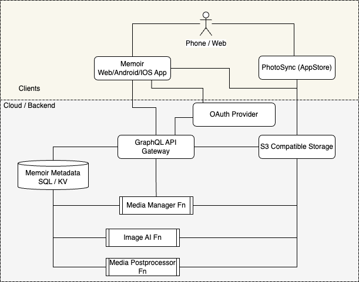
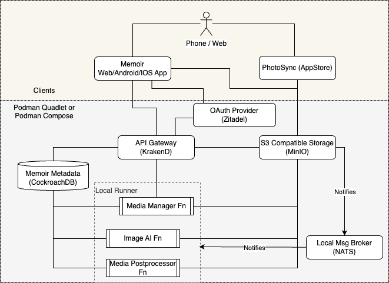

# Memoir - A Serverless Photo, Video,Life's Memory Service...

_This is a early draft of the Memoir SaaS open-source service that is in active
development. Details will change as the design is more fully flushed out._

## About / Why

Why another Photo/Video/Etc... family album type app when there are some great
services already out there like [Photoprism](https://www.photoprism.app/),
[immich](https://immich.app/) and Google/Apple/Amazon/[insert big company] Photos?

Big company solution are great for individuals. Family type env not so much
(IMHO). The other self hosted solutions I have found required an always on
running server. Running on a home server is great until it's not. Running
a full time compute service in the cloud (ATM) is more expensive than a
commercial alternative without even including storage. This is especially bad
for my family use case where that compute would be sitting idle most of the time
but costing money the whole time it was up. Thus the birth of this project.

The end goal of this project is to try to create a setup that can be local or
cloud based that doesn't require a dedicated compute service. Ideally the
final product will not be too much more complicated than the existing self
hosted options.

## High Level Design Thoughts

Service Mappings:

| Service       | AWS         | Azure     | GCP          | Local                |
| ------------- | ----------- | --------- | ------------ | -------------------- |
| _Storage_     | s3          | TBD       | Object Store | MinIO                |
| _API Gateway_ | API Gateway | Azure Fns | Cloud Fns    | KrakenD              |
| _Functions_   | labmda      | Azure Fns | Cloud Fns    | TBD                  |
| _IdP_         | Cognito     | Entra     | Identity     | Keycloak/Zitadel     |
| _Metadata_    | ?           | ?         | ?            | CockroachDB (PgSQL)  |
| _AI_          | Rekognition | Vision    | Vision       | NasNet/Resnet/etc... |

The goal is make this easier for others to deploy. This above chart assumes
staying within the cloud specific ecosystem.

To simplify end user instructions and to support potential hybrid situations,
this may change to these services that have both Cloud(serverless) and Local
deployable solutions:

| Service    | Provider    |
| ---------- | ----------- |
| _IdP_      | Zitadel     |
| _Metadata_ | CockRoachDB |

By breaking up the functionality this way it should allow a flexible
configurations:

- Local/Cloud storage mirroring via MinIO Mirror functionality.
- Expensive AI functions / Model functions run on local system with other
  functions running in cloud.
- Have thumbnail generation happen locally.
- Replicate local and remote data with CockroachDB.

### Security

- OAuth2.
- Claims/Attributes Based Access Control (CBAC/ABAC)
- IAM policies.
- TLS encrypted network connections between all service.
- s3/CockroachDB encryption at rest with Customer Managed Encryption Keys(CMEK)
  when in cloud.
- CockroachDB data encrypted tables with CMEK for cloud configurations.

## Clients

### [PhotoSync](https://www.photosync-app.com/)

First step will be to focus on the backend and yet I still want to be able to
have a way that pictures the family takes can be sent to the storage system.
This is where the [PhotoSync](https://www.photosync-app.com/) app comes into play.

Weather using local or cloud s3 storage this app can be configured to
auto upload into a bucket.

### Memoir Client - Progressive Web App / Android / IOS

This will be a SPA able to be hosted anywhere that serves a static website.
The design is TBD but will have the expected functionality.

- View Media.
  - Mapping
- Manage Albums/Media.
  - Expected functionality +
  - Sharing images if permissible.
  - Simple image editing via EXIF data updates.
  - Ability to associate names with facial thumbnails for facilitate grouping
    by people.
  - Search Media by labels / people.
- Upload media.
- Auto upload media on Android/IOS.
- Server Admin.
  - Manage Users.
  - Manage Album Permissions.

Thoughts... The WebONNX project looks interesting maybe better to do the
object identification locally as part of the upload process. Maybe give the
user a chance to select labels before upload.

## Services

### OAuth2 IdP Provider

[Zitadel](https://zitadel.com/) offers both a local container and a low cost
cloud solution. ATM going this route. Alternatively AWS Cognito could be used
for an all-in-one AWS solution.

### Media Datastore

s3 or s3 compatible object store. Pretty much everyone but Azure offers an
s3 compatible object store. All the major cloud vendors offers hot, warm, cold
storage options / price-breaks.

Also planning on using [OpenDAL](https://opendal.apache.org/) so that s3
compatibility may not always be the requirement.

### Database / KV Store

PgSql Based. CockroachDB/Neon/etc... offer low cost serverless PostgreSQL DB
compatible interface.

### API Gateway

Handles security the API endpoint. Has the ability to:

- Validate IdP JWTs.
- Route to proper function endpoint.
  - For AWS this is the lambda.
  - For Local this will be the a stub service running in a container.

### Functions (AKA Lambda's for AWS)

Ideally these would be created in a way that would be abstracted from the
AWS Lambda, Azure Function, and GCP Cloud Function signatures but that is still
TBD. I looked at Nitric shows promise but ATM doesn't meet requirements.

#### Memoir GraphQL API Function

This is the user facing interface bundle of functionality. The input will be
GraphQL queries and the responses will be JSON.

Functionality:

- Manage Media.
  - CRUD.
  - Manage Permissions.
  - Manage Sharing.
- Admin.
  - Manage Users.
  - Manually Trigger Analysis Operations.

#### Memoir AI Analysis Function

All the cool kids are doing AI and so will Memoir. This will take the lessons
learned from the [smugmug_syncer](https://github.com/cch71/smugmug_syncer) project
and apply them in combination with the Memoir Client to allow some cool stuff.

It will:

- Run whenever a new image is added.
- Perform NSFW analysis.
- Perform object detection and labels categorization and save to media metadata.
- Perform facial analysis, create facial thumbnails, generate facial embedding
  data and save to media metadata.
- For Cloud:
  - Use Rekognition or other cloud vision service.
- For local operations (and potentially for cloud):
  - Use the [Nasnet](https://huggingface.co/docs/timm/en/models/nasnet) model
    withImageNet classes for image labeling.
  - Use the [Dlib](https://dlib.net/) facial recognition models.

TBD: Evaluate Rekognition/Google Vision/Other pricing and compare with caching
the NasNet/Dlib models in s3. I will start out with the local AI analysis since
that is already working.

#### Memoir Postprocessor Function

Whenever an image is added this will be kicked off to generate and store
metadata.

Functionality:

- Run whenever a new image is added.
- Generate the image checksum.
- Generate the preview thumbnail image.
- Extract location and other queryable image information from the EXIF.

#### Function Runner (Local Only)

Provides an endpoint for running the "Cloud" functions locally. OpenFaaS maybe
an option one day however for now it seemed easier to roll my own.

Functionality:

- Take the 3 Memoir services and handle launching them on demand.
  WASI based would be nice however the concern is the AI analysis within the
  WASM limited sandbox.
- Interface with the NATS service to know when to trigger the Memoir
  Postprocessor and Memoir AI Functions

### NATS service (Local Only)

To use the MinIO notification functionality locally a NATS service is needed
(or at least the more interesting options).

## What a Local Configuration My Look Like

## Detailed Designs

- [Media and Metadata Storage](storage.md)
- [Security](security.md)
- [Memoir API Function](fn_api.md)
- [Memoir Media Postprocessing Function](fn_media_postprocessing.md)
