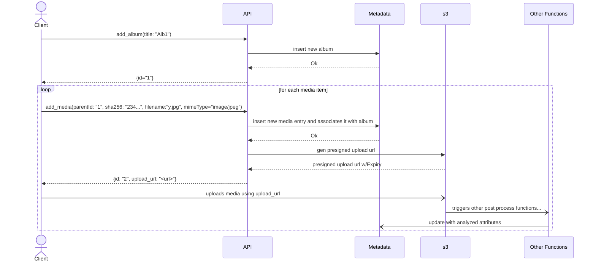
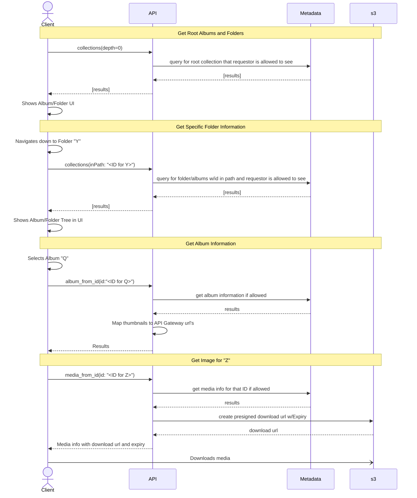

# Memoir API Function Detailed Design

The API Function will be called from the API Gateway. It will be responsible
for processing client requests.

For a local service this is ran under the local service. For AWS it would
represent a Lambda function.

## Inputs / Outputs

Inputs: Uses GraphQL requests. Refer to the [GraphQL Schema](graphql.schema).

Outputs: Produces a JSON response.

The API Gateway should handle access to thumbnail images.
This API will have s3 interface generate a presigned URL for downloading
data.

## Add Album / Media

NOTE: _not showing security checks or error handling_

## Client Possible Starting Scenario

