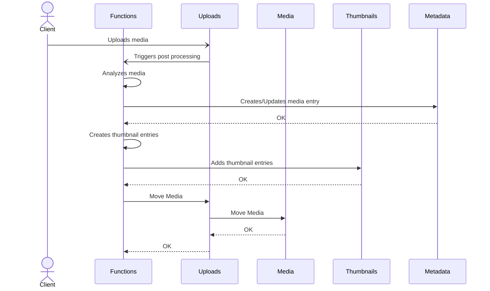

# Memoir Media and Metadata Storage

## Media Storage

S3 storage is an industry standard with many major cloud vendor's supporting it
natively. On top of that there are many 3rd party s3 compatible storage
solutions that can be self hosted. For those reason the focus will be on using
s3 interfaces. That said it will be a pluggable storage interface so that it
can be swapped out.

Buckets:

- MemoirUploads:
  - Up to uploader on how it handles duplicates / name collisions.
  - There will be a processing step that will trigger moving them to the
    MemoirMedia bucket and removing them from this folder.
- MemoirMedia:
  - Holds the media files after they are post processed.
  - The name will be a string representing the SHA-256.
  - Metadata included with object will include:
    - The original filename.
    - UUIDv7.
    - Media type (Image/Video/Other...).
  - May be setup to replicate with other s3 service
- MemoirThumbnails:
  - Holds generated media from files put in the MemoirMedia folder.
  - Will contain Thumbnails of the original.
  - Will contain Facial Thumbnails if found in the original.
  - May be setup to replicate with other s3 service.



## Metadata Storage

The development interface for metadata will also be abstracted out to support
using alternative mechanisms. ATM the plans are to only support a PgSQL
interface. Specifically will target CockroachDB however any PgSQL db should
suffice. ATM there are no plans to get "fancy" with the SQL.

Tables:

- Media

  - Fields:
    - id: UUIDv7 UNIQUE
    - sha256: STRING UNIQUE
    - size: BIGINT UNSIGNED
    - width: BIGINT UNSIGNED
    - height: BIGINT UNSIGNED
    - location: GEOGRAPHY(POINT, 4326)
    - date_taken: TIMESTAMPTZ
    - date_added: TIMESTAMPTZ
    - date_updated: TIMESTAMPTZ
    - filename: STRING
    - title: STRING
    - description: STRING
    - labels: ARRAY[STRING]
    - people: ARRAY[STRING]
    - facial_thumbnail_ids: ARRAY[STRING]
    - exif: JSONB
    - mime_type: STRING
    - security: JSONB

- Collections

  - Fields:
    - id: UUIDv7 UNIQUE
    - title: STRING
    - description: STRING
    - date_added: TIMESTAMPTZ
    - date_updated: TIMESTAMPTZ
    - security: JSONB
    - sort_direction: SORT_DIRECTION
    - sort_by: SORT_BY
    - collection_type: COLLECTION_TYPE
    - Valid only for 'media' collections
      - upload_url: STRING
      - upload_url_lifetime: TIMESTAMPZ

- Collections Closure Tree

  - Used to keep track of parent child relationships of folder types
  - [Reference](https://medium.com/@yusoofash/handling-hierarchical-data-with-closure-tables-in-postgresql-167aac3a74f2)
  - Fields:
    - prev: UUIDv7 NOT NULL
    - next: UUIDv7 NOT NULL
    - depth INTEGER NOT NULL

- Media In Album Table

  - Links media to albums
  - Fields:
    - media_id: UUDv7
    - album_id: UUDv7
  - Unique together

```sql
CREATE TABLE album_media (
    album_id UUID REFERENCES collections(id) ON DELETE CASCADE,
    media_id UUID REFERENCES media(id) ON DELETE CASCADE,
    PRIMARY KEY (album_id, media_id)
);
```

- Users

  - Fields:
    - id: STRING UNIQUE
    - first: STRING
    - last: STRING
    - roles: ARRAY[UUIDv7]

- Roles

  - Roles will be mostly pre-defined but may allow custom roles in the future
  - Fields:
    - id: UUIDv7 UNIQUE
    - title: STRING
    - description: STRING

Misc types:

- SORT_DIRECTION: 'ascending', 'descending';
- SORT_BY: 'filename', 'data_added', 'date_modified', 'date_taken'
- COLLECTION_TYPE: 'album', 'folder'

Notes:

- A Collection could in theory hold media and folders however, to simplify logic,
  it wont.
- Security is still be flushed out. Using this as a reference:
  - [CBAC Reference](https://supabase.com/docs/guides/database/postgres/custom-claims-and-role-based-access-control-rbac)
- 'Unsorted' Album with be NULL for admin level unsorted or the ID for the user.
